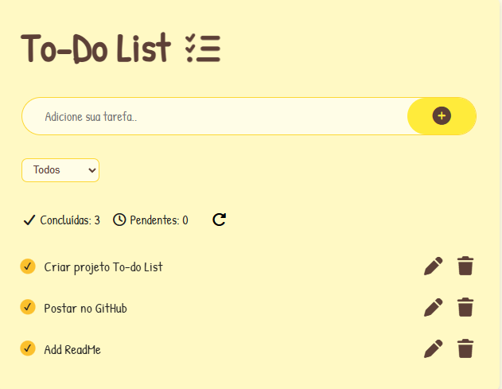

To-Do List 📝

## 🔹 Preview

<h2 align="center">📸 Preview do Projeto</h2>

  

## 🚀 Acesse o projeto online

🔗 [Clique aqui para acessar o site](https://viniciospereira-dev.github.io/Projeto-To-do-List/)

Uma aplicação web simples para gerenciamento de tarefas, construída com HTML, CSS e JavaScript. Permite adicionar, editar, marcar como concluída e remover tarefas, além de filtrar por status e salvar os dados no LocalStorage do navegador.

🔹 Funcionalidades

Adicionar novas tarefas com limite de 40 caracteres.
Editar tarefas existentes.
Marcar tarefas como concluídas (checked) ou pendentes.
Remover tarefas individualmente com confirmação.

Filtrar tarefas por:

Todas
Concluídas
Pendentes
Contadores de tarefas concluídas e pendentes.
Resetar todas as tarefas.

Armazenamento automático das tarefas no navegador (LocalStorage).

Interface responsiva e animada com efeitos de hover.

🔹 Tecnologias Utilizadas

HTML5: Estrutura da aplicação.
CSS3: Estilo moderno com cores e animações.
JavaScript (Vanilla JS): Manipulação de DOM, eventos e LocalStorage.
Font Awesome: Ícones para adicionar, editar e remover tarefas.
Google Fonts: Fontes Poppins e Patrick Hand.

🔹 Melhorias Futuras

Adicionar categorias personalizadas de tarefas.
Permitir arrastar e soltar para reorganizar tarefas.
Tema escuro.
Integração com banco de dados para persistência em múltiplos dispositivos.

